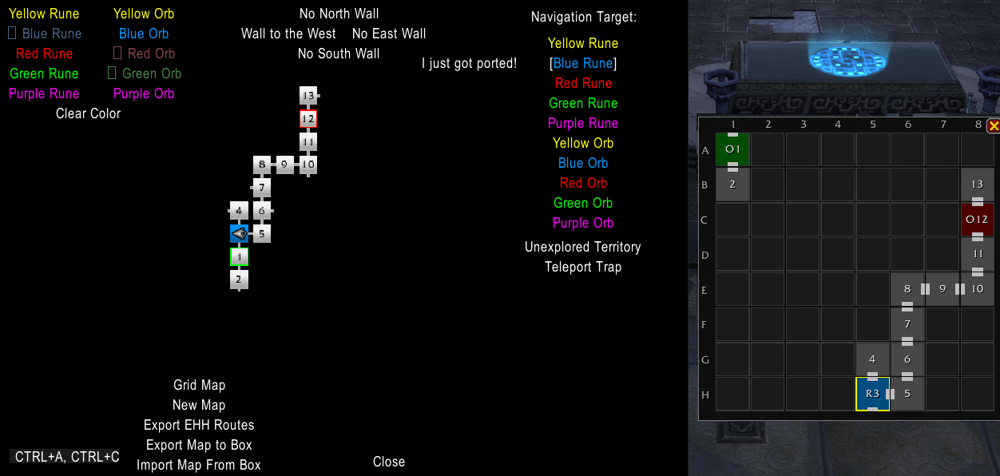

# LucidNav – Lucid Nightmare Maze Navigator

**LucidNav** is a World of Warcraft addon that helps you navigate the **Endless Halls** maze required to obtain the [**Lucid Nightmare**](https://www.wowhead.com/item=151623/lucid-nightmare) secret mount.

Instead of drawing the maze manually on paper, LucidNav **automatically builds a live map of the labyrinth as you explore** and guides you step-by-step to any destination.

---

## Features

- **8×8 grid map** — live visual overview of explored rooms and corridors
- **Turn-by-turn navigation** — guides you to unexplored rooms, runes, orbs, or the teleport trap
- **Wall marking** — manually mark blocked corridors using the cardinal direction buttons
- **Teleport trap handling** — automatically tracks and highlights the teleport trap room
- **Persistent map** — your maze progress is saved and restored automatically
- **Map export / import** — share or back up your maze map using a serialized format

---

## Installation

1. Download the latest release from CurseForge  
2. Extract the folder `LucidNav` into: `World of Warcraft/retail/Interface/AddOns/`
3. Restart the game or reload the UI with: `/reload`

---

## How to Use

1. Enter the **Endless Halls**
2. Open the addon with: `/lnn`, `/ln`, or `/lucid`
3. Walk around normally — the addon builds the maze map automatically
4. When you discover a **rune or orb**, click its matching color in the **Points of Interest** panel
5. Use the **Navigation Target** buttons to get directions to any POI or unexplored area
6. If you get teleported by the trap room, click **"I just got ported!"** immediately

You can open the **Grid Map** anytime for a bird’s-eye view of your exploration progress.

---

## Tips for Solving the Maze

- Do **not extinguish runes early** — they are essential navigation landmarks
- Use navigation to reach **unexplored rooms first**
- The teleport trap is marked in **orange** and navigation avoids routing through it
- Export your map occasionally to keep a backup of your progress

---

## Planned Improvements

Future versions may include additional quality-of-life features such as:

- **Automatic rune and orb detection** using game events
- **Automatic wall detection** when movement into a corridor fails
- Navigation and UI improvements
- Additional visualization enhancements for the maze map

---

## Compatibility

Tested with:

- World of Warcraft **12.x – The War Within**

---

## Credits

This addon is a fork and enhancement of  
[**LucidNightmareNavigator**](https://github.com/Debuggernaut/LucidNightmareNavigator) by Debuggernaut.

Map visualization concept inspired by:

[https://nightswimmer.github.io/EndlessHalls](https://nightswimmer.github.io/EndlessHalls)

---

## Contributing

Contributions are welcome.

If you find a bug or have a feature request, please open an issue or submit a pull request.

## License

This project is licensed under the MIT License.