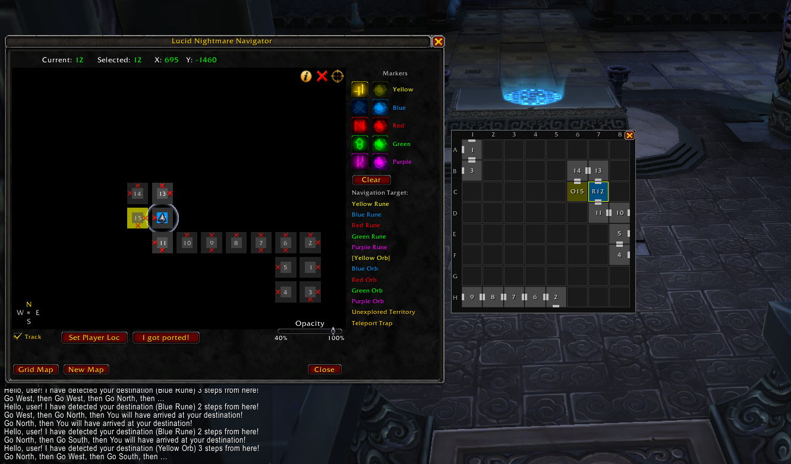

# LucidNav – Lucid Nightmare Maze Navigator

**LucidNav** is a World of Warcraft addon that helps you navigate the **Endless Halls** maze required to obtain the [**Lucid Nightmare**](https://www.wowhead.com/item=151623/lucid-nightmare) secret mount.

Instead of drawing the maze manually on paper, LucidNav **automatically builds a live map of the labyrinth as you explore** and guides you step-by-step to any destination.

---

## Features

- **Live map canvas** — 35×35 rooms auto-built as you explore; right-click-drag to pan
- **Click-to-interact cells** — click the center of a room to select it; click an edge to toggle a wall
- **8×8 grid map** — opens alongside the main window for a bird's-eye overview of exploration progress
- **Turn-by-turn navigation** — guides you to unexplored rooms, runes, orbs, or the teleport trap
- **Color-coded POI markers** — mark runes and orbs with icon buttons (yellow, blue, red, green, purple)
- **Compass rose** — N/S/E/W overlay on the map canvas for cardinal direction reference
- **Live player coordinates** — X/Y world position displayed in the header, updated in real time
- **Teleport trap handling** — automatically tracks and highlights the teleport trap room (orange)
- **Persistent map** — maze progress saved on logout; on proper logout you respawn at room 1, on crash/DC you return to your last room

---

## Installation

1. Download the latest release from CurseForge  
2. Extract the folder `LucidNav` into: `World of Warcraft/retail/Interface/AddOns/`
3. Restart the game or reload the UI with: `/reload`

---

## How to Use

1. Enter the **Endless Halls**
2. Open the addon with: `/lnn`, `/ln`, or `/lucid` — the map and grid open together
3. Walk around normally — the addon builds the maze map automatically
4. **Click the center** of any room to select it; **click an edge** to toggle a wall on that side
5. When you discover a **rune or orb**, select the room and click its matching color marker in the right panel
6. Use the **Navigation Target** buttons to get step-by-step directions to any POI or unexplored area
7. If you get teleported by the trap room, click **"I got ported!"** immediately — the room turns orange

---

## Tips for Solving the Maze

- Do **not extinguish runes early** — they are essential navigation landmarks
- Use navigation to reach **unexplored rooms first**
- The teleport trap is marked in **orange** and navigation avoids routing through it
- **Proper logout** (20-second timer): you respawn at Room 1 — the addon resets your position automatically
- **Force-close / crash / DC**: you return to your last room. Walk to a known room and use **Set Player Loc** to correct your position
- The maze **resets every daily reset** — finish your run before the server reset!

---

## Compatibility

Tested with:

- World of Warcraft **12.0.5 – Midnight**

---

## Credits

This addon is a fork and enhancement of  
[**LucidNightmareNavigator**](https://github.com/Debuggernaut/LucidNightmareNavigator) by Debuggernaut.

The v1.1 UI redesign — larger cells, right-click panning, click-to-select / click-edge-to-wall, icon POI markers, jump dialog, and compass rose — was inspired by and based on  
**LucidNightmareMaze** by [Shtock](https://github.com/Shtock). Special thanks for the clean architectural patterns that made the working pan implementation possible.

Map visualization concept inspired by:

[https://nightswimmer.github.io/EndlessHalls](https://nightswimmer.github.io/EndlessHalls)

---

## Contributing

Contributions are welcome.

If you find a bug or have a feature request, please open an issue or submit a pull request.

## License

This project is licensed under the MIT License.