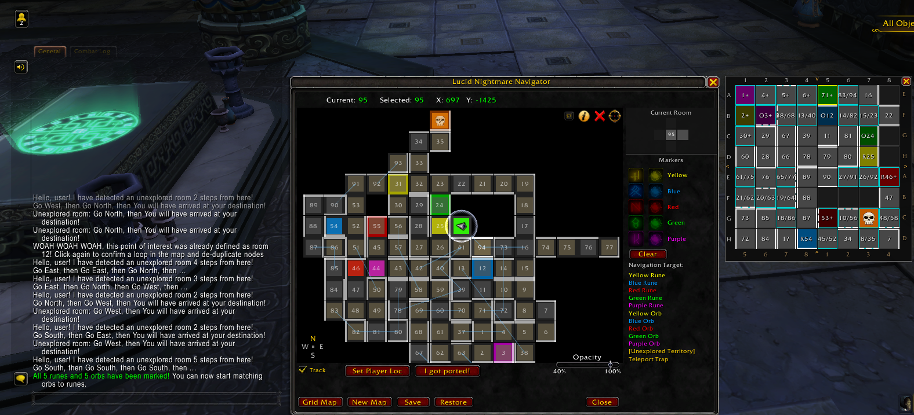
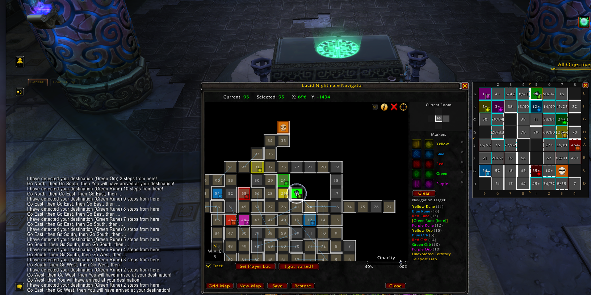
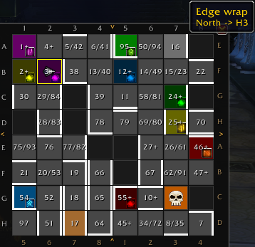

# LucidNav – Lucid Nightmare Maze Navigator

**LucidNav** is a World of Warcraft addon that helps you navigate the **Endless Halls** maze required to obtain the [**Lucid Nightmare**](https://www.wowhead.com/item=151623/lucid-nightmare) secret mount.

Instead of drawing the maze manually on paper, LucidNav **automatically builds a live map of the labyrinth as you explore** and guides you step-by-step to any destination.



---

## Features

### Mapping
- **Live map canvas** — rooms (35×35px cells) auto-built as you explore; right-click-drag to pan
- **Click-to-interact cells** — click the center of a room to select it; click an edge to toggle a wall
- **Current-room reference panel** — a 5-cell cross at the top-right with **N/E/S/W buttons** to toggle the selected room's walls directly (no fiddly edge-clicking)
- **Edge-hover highlight** — hovering a cell edge highlights exactly which wall you're about to toggle
- **Overlap / cross indicator** — rooms that share a maze grid cell get a subtle **amber tint** so intentional crosses don't look broken
- **8×8 grid map** — a bird's-eye overview that opens alongside the main window

### Points of interest
- **Rune & orb icons** — POI rooms show the **actual rune glyph or orb icon** (on both the main canvas and the 8×8 grid), not just a colored cell
- **Color-coded markers** — mark runes and orbs with icon buttons (yellow, blue, red, green, purple)
- **Match tracker** — a per-color toggle marks a rune+orb pair as **done**; matched pairs dim out and show a ✓, so you can see at a glance what's left

### Navigation
- **Turn-by-turn navigation** — guides you to unexplored rooms, runes, orbs, or the teleport trap
- **Live step counts** — every navigation target shows its distance from your current room, updated on each move (`(here)` when you're standing on it)
- **Unreachable-POI warning** — if a stray wall toggle accidentally seals off a known rune/orb, the addon warns you immediately instead of silently losing the route
- **Player arrow** — the grid marks your current cell with the **same facing arrow** as the main map
- **Edge-wrap hints** — hover a border cell in the grid to light up **exactly which cell you'll emerge in** after the maze's ±4 wrap, Pac-Man-tunnel style
- **Compass rose** — N/S/E/W overlay on the map canvas
- **Live player coordinates** — X/Y world position in the header, updated in real time

### Session
- **Teleport trap handling** — automatically tracks and highlights the teleport trap room (orange); navigation never routes through it
- **Persistent map** — maze progress saved on logout; on proper logout you respawn at room 1, on crash/DC you return to your last room
- **Undo** — step back the last action in-memory (lost on `/reload`)
- **Named checkpoints (Save / Restore)** — timestamped map snapshots that survive `/reload` and relog, so you can roll back to a good state after a mistake — no more screenshotting the map at every step





---

## Installation

1. Download the latest release from CurseForge  
2. Extract the folder `LucidNav` into: `World of Warcraft/retail/Interface/AddOns/`
3. Restart the game or reload the UI with: `/reload`

---

## How to Use

1. Enter the **Endless Halls**
2. Open the addon with: `/lnn`, `/ln`, or `/lucid` — the map and grid open together
3. Walk around normally — the addon builds the maze map automatically
4. **Click the center** of any room to select it; **click an edge** to toggle a wall on that side
5. When you discover a **rune or orb**, select the room and click its matching color marker in the right panel
6. Use the **Navigation Target** buttons to get step-by-step directions to any POI or unexplored area — each shows its live step count from where you stand
7. Once all 5 runes and 5 orbs are marked, work through the matches: hit the small **✓ toggle** on a color row to mark that rune+orb pair as done
8. If you get teleported by the trap room, click **"I got ported!"** immediately — the room turns orange

---

## Saving progress & undoing mistakes

Mapping the Endless Halls is long, and one wrong click (a mis-placed *"I got
ported!"*, a bad de-duplicate, an overlapping room) can tangle the map. LucidNav
has two safety nets so you never have to screenshot your progress:

- **Undo** — reverts the **last action**. It's in-memory only, so it's instant
  but is **lost on `/reload`** and only steps back one action at a time.
- **Checkpoints (Save / Restore)** — the durable option. Click **Save** to store
  a **timestamped snapshot** of the entire map (rooms, positions, walls, POIs,
  trap). Click **Restore** to pick any earlier snapshot from the list (newest
  first) and roll the whole map back to it.
  - Snapshots are written to your SavedVariables, so they **survive `/reload`,
    relog, crashes, and DCs**.
  - A **Restore is itself undoable**, so trying one is safe.
  - Keeps your **10 most recent** snapshots (the oldest is dropped automatically).

**Recommended workflow:** click **Save** whenever you reach a clean milestone
(each new rune/orb, before a risky de-dup, before pressing *"I got ported!"*).
If a step goes wrong, **Restore** the last good snapshot instead of wiping and
rebuilding from a screenshot.

Slash-command equivalents:

```
/ln save [name]     -- save a checkpoint (defaults to the current time)
/ln restore <name>  -- restore a named checkpoint
/ln checkpoints     -- list saved checkpoints
/ln undo            -- undo the last action
```

---

## Tips for Solving the Maze

- Do **not extinguish runes early** — they are essential navigation landmarks
- Use navigation to reach **unexplored rooms first**
- The teleport trap is marked in **orange** and navigation avoids routing through it
- **Proper logout** (20-second timer): you respawn at Room 1 — the addon resets your position automatically
- **Force-close / crash / DC**: you return to your last room. Walk to a known room and use **Set Player Loc** to correct your position

---

## When does the maze reset?

The Endless Halls layout is **not** tied to the weekly/daily instance lockout. Blizzard's
own wording — *"coming back the next day will present you with an entirely new challenge"* —
and player testing both point to the maze being generated **per character from your player ID
+ the current date**, roughly:

```
mazeSeed = Hash(playerGUID + realmDate)
```

Practical consequences:

- **Logging out briefly keeps the same maze** — your saved LucidNav map stays valid, so a quick relog mid-run is safe.
- **The maze changes once per day**, at approximately **realm midnight (00:00 server time)** — independent of the 10:00-server dungeon reset. (Observed at 00:00 UTC-5 realm time ≈ 02:00 in UTC-3.)
- After the day rolls over, the **old map is invalid**. If the starting room's exits or POIs no longer match what LucidNav shows, click **New Map** and start fresh.

> **Tip:** finish a run in a single day. If you must stop, note the server clock — anything close to midnight server time means the maze may regenerate under you.

---

## Compatibility

Tested with:

- World of Warcraft **12.0.5 – Midnight**

## Localization

LucidNav automatically displays in your WoW client's language: **English**,
**Spanish** (`esES`/`esMX`), **Portuguese** (`ptBR`), **German** (`deDE`), and
**Simplified Chinese** (`zhCN`) are supported, with English as the fallback
for any other locale. No settings needed — it's detected automatically.
Translations are a first draft (not yet reviewed by native speakers) —
corrections are welcome via GitHub issues or pull requests.

---

## Credits

This addon is a fork and enhancement of  
[**LucidNightmareNavigator**](https://github.com/Debuggernaut/LucidNightmareNavigator) by Debuggernaut.

The v1.1 UI redesign — larger cells, right-click panning, click-to-select / click-edge-to-wall, icon POI markers, jump dialog, and compass rose — was inspired by and based on  
**LucidNightmareMaze** by [Shtock](https://github.com/Shtock). Special thanks for the clean architectural patterns that made the working pan implementation possible.

Map visualization concept inspired by:

[https://nightswimmer.github.io/EndlessHalls](https://nightswimmer.github.io/EndlessHalls)

---

## Contributing

Contributions are welcome.

If you find a bug or have a feature request, please open an issue or submit a pull request.


## License

This project is licensed under the MIT License.